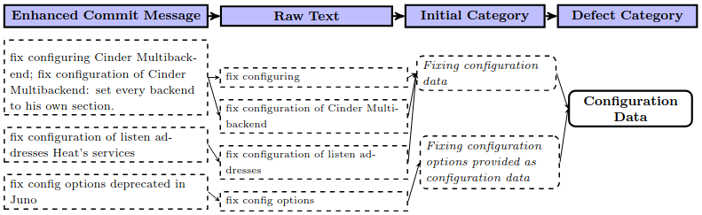
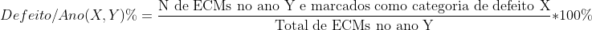

# Metadados

* **Título**: Gang of Eight: A Defect Taxonomy for Infrastructure as Code
Scripts
* **Autores**: Akond Rahman, Effat Farhan, Chris Parnin, Laurie Williams
* **De que instituições são os autores?**: _Tennessee Tech University_ e _NC State University_
* **Onde foi publicado**: IEEE/ACM 42nd International Conference on Software Engineering (ICSE)
* **Ano de publicação**: 2020
* **Link de Acesso**: [Gang of Eight: A Defect Taxonomy for Infrastructure as Code
Scripts](https://doi.org/10.1145/3377811.3380409)

# Qual o problema?

Os códigos de _Infrastructure as a code_ (IaC) podem apresentar inúmeros tipos de defeitos, atualmente os erros não são agrupados por características em comum, caso fosse feito uma categorização poderíamos identificar os erros e realizar as suas correções de maneira mais rápida e eficiente.

# Qual a solução?

## Como os autores tentam resolver o problema? Criando um algoritmo novo? uma metodologia? uma ferramenta? 

Os autores buscaram solucionar esse problema propondo uma categorização ds erros em códigos IaC, dividida em 8 subcategorias. A proposta foi submetida à avaliação de desenvolvedores experientes em IAC e aprovada com pequenas ressalvas. 

Os autores propuseram a seguinte categorização:
* **Condicional (Conditional):** Erros de lógica e/ou valores de condicionais em códigos IaC.
* **Dados de Configuração (Configuration Data):** Paths incorretos de dados de configuração na hora de construir o código IaC.
* **Dependência (Dependency):** Erros que acontecem devido a dependência do código IaC em Artefatos (Arquivo, Classe, Package, Módulo, ou Puppet Manifest) que estão ou faltando ou incorretamente especificados.
* **Documentação (Documentation):** Informação incorretas acerca de códigos IaC especificados no código como comentario, em notas de manutanção e em arquivos de documentação.
* **Idempotência (Idempotency):** Propriedade que garante que depois de N execução, onde N < 1, o ambiente provisionado do sistema é exatamente o mesmo. Assim é categorizado como erros de Idempotências aqueles que ferem essa propriedade.
* **Segurança (Security):** Brechas de segurança, confiabilidade, integridade ou disponibilidade no ambiente provisionado.
* **Serviço (Service):** Provisionamento impróprio e disponibilidade inadequada de serviços de computação da cloud.
* **Sintaxe (Syntax):** Erros de sintaxe em códigos Iac.

## Quais são os detalhes técnicos dessa solução? O que chama mais atenção? Qual a ideia geral e o que deve ser discutido em mais detalhes?

Os autores propõem uma ferramenta (ACID - Automated Categorizer for Infrastructure as Code Defects) que faz a análise de ECMs (Enhanced Commit Message), que é a combinação entre a messagem do commit com qualquer descrição de relatório de bug existente, e faz a devida categorização dessa mensagem em uma das 8 subcategorias propostas, se nenhuma das 8 categoria é identificada o output é "NO DEFECT". 

A ACID utiliza a técnica de *descriptive coding* para ser feita a análise qualitativa dos ECM.

Exemplo do processo de derivação das categorias utilizando _descriptive coding_:

# Como foi avaliado?

Os autores testaram a ferramenta testando em alguns repositórios open source, para isso foram estabelecidos alguns critérios para escolha desses repositórios, como:

1. Pelo menos 11% dos arquivos do repositório tem que ser script IaC.
2. O repositório não pode ser uma cópia de outro repositório.
3. Deve conter pelo menos dois commit por mês.
4. Ter mais pelo menos 10 contribuidores.

Assim, foi construindo três datasets de repositórios OpenSources que são mantidos por três organizações: Mozila, Openstack e Wikimedia Commons. O critério de escolha dessas organizações foi a alta utilização de serviços de cloud. Além desses três dataset, foi criado mais um de repositórios OpenSources mantidos no GitHub.

Além disso, os autores analisam a frequência das categorias de defeitos que aparecem em scripts IaC, por meio da seguinte métrica:

# Quais são os resultados?

- Dados de Configuração é a categoria mais frequente de acordo com a métrica estabelecida e também a mais domintante entre os 4 datasets.
- Network é a subcategoria mais frequente: 75.3%~88.2% dos erros identificados de dados de configurações são de network.
- Idempotência é a categoria menos frequente de acordo com a métrica estabelecida.
- Entre todos os repositórios observados, incluem pelo menos um das oito categorias, porém não mais 4 categorias ao mesmo tempo.

# Resenha crítica

O artigo categoriza os defeitos que ocorrem em arquivos de infraestrutura, e sua análise é bastante relevante. No entanto, ela pode apresentar limitações, pois leva em consideração apenas as ECMs. Para aprofundar o estudo, acredito que seja necessário considerar também o estado do código no momento da ocorrência do defeito, possibilitando uma análise mais precisa.

A categorização dos erros baseia-se em falhas já conhecidas, mas acredito que os conceitos propostos poderiam ser mais precisos em suas definições. Seguindo esse raciocínio, pode ser que tal abordagem não tenha sido feita porque os autores não consideraram os trechos de código no estado do arquivo IaC quando o defeito foi identificado nos commits.

Além disso, os resultados foram limitados ao Puppet. Embora o artigo mencione que há evidências de que a categorização proposta se aplica a diferentes linguagens de IaC, esses dados não foram explorados em profundidade.

# Discussão

Deixar aqui os comentários e insights importantes que surgiram durante a discussão do paper com o grupo. 

* Replicar a análise nos repositórios da VTEX e fazer a comparação com as categorias do gang of eight.

* Por qual motivo a Idempotência apresentou a menor quantidade de categorização? 

* Identificar Fix Pattern e não ficar dependente dos comentários em commit, saber a possibilidade de falha pré-commit. 

# O que eu tenho a ver com isso?

É necessária a replicação deste estudo, com o objetivo de identificar um ponto comum entre as categorizações propostas e o estado do código IaC correspondente. Para isso, é fundamental que seja possível analisar o código no momento em que a falha foi reportada e compará-lo com a versão anterior. Dessa forma, será viável identificar o trecho de código que foi removido ou alterado para corrigir a falha, possibilitando o mapeamento das partes do código mais suscetíveis a erros.

Essa identificação é crucial no contexto do Cloud Drift Monitor, pois precisamos reconhecer quais trechos de código e suas modificações apresentam maior sensibilidade. Assim, será possível notificar a probabilidade de ocorrer alguma falha em um futuro próximo.

# Replicação

* Onde estão os dados?
    - Em um FigShare inexistente, vou mandar um email.
* Onde está o código?
    - [Automated Categorizer for Infrastructure as Code Defects (ACID)](https://hub.docker.com/r/akondrahman/acid-puppet)
    - [Github Link](https://github.com/akondrahman/IaC_Defect_Categ_Revamp)
* Conseguiu entender/rodar? 
    - Estou trabalhando nisso, porém dá pra rodar!
* Dá para replicar o experimento/estudo? 
    - Sim!

